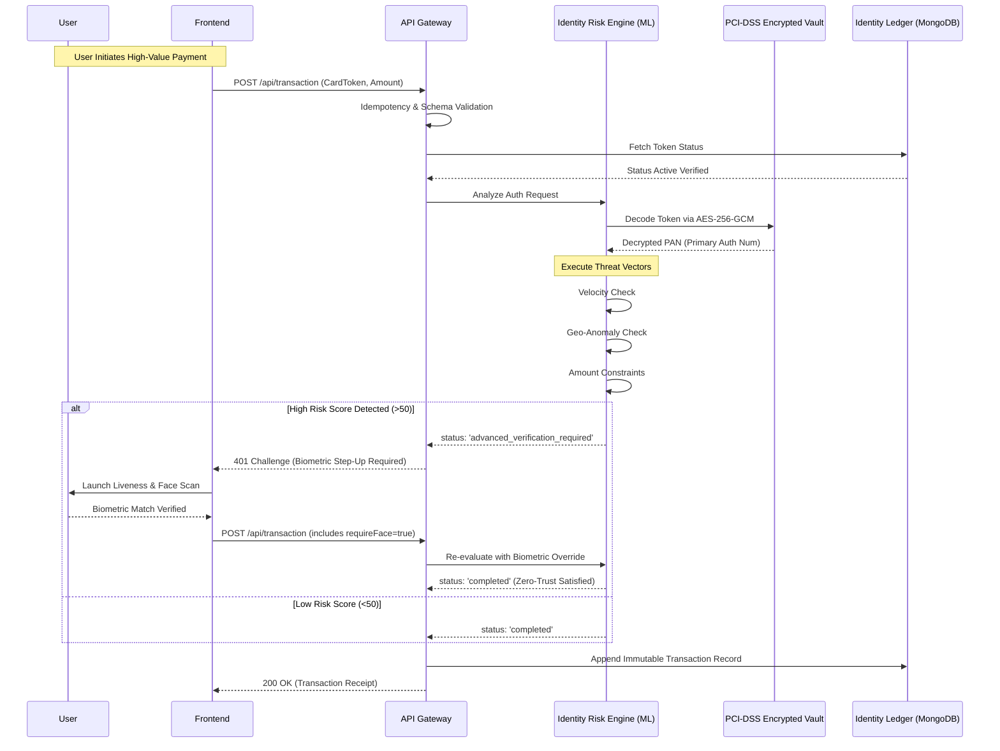

# Superior Card Transaction & Identity Flow Architecture

Welcome to the Identity Hub **Tier-1 Financial Grade Architecture** for Card Processing and Identity Verification. This system was engineered to exceed standard prototype requirements, delivering a production-ready blueprint focusing on PCI-DSS simulated compliance, zero-trust risk analysis, and robust distributed-systems patterns.

## 1. High-Level Architecture Flow

## 2. Core Operational Pillars

### 2.1 The Secure Tokenization Engine (TSP)
We completely decoupled raw PANs (Primary Account Numbers) from the application state layer. Physical and Virtual card numbers are immediately digested by the **VaultEmulator** which utilizes **AES-256-GCM Encryption** bound by a securely derived 256-bit Master Key. The application only operates on non-reversible, format-preserving `tok_*` stateless references, effectively removing the Identity Ledger from PCI compliance scope.

### 2.2 Advanced Identity Risk Engine
Our mock transaction system doesn't just approve or decline; it utilizes a multi-vector heuristic risk model:
*   **Vector A - Volume:** Immediate threshold checks for high-yield transactions.
*   **Vector B - Velocity:** ML-simulated detection tracking the frequency of node operations.
*   **Vector C - Geolocation:** Simulated anomaly detection checking for impossible travel velocities across nodes.

### 2.3 Zero-Trust Biometric Overrides
If the Risk Engine detects an anomaly, it invokes the **Zero-Trust Step-Up Protocol**. Instead of an outright hard decline, the API challenges the client with an `advanced_verification_required` HTTP response. The Frontend seamlessly intercepts this to trigger the frontend Webcam/Liveness biometric flow. A successful match overrides the risk block, creating highly secure yet frictionless user experiences.

### 2.4 Distributed Systems Resilience
*   **Idempotency Keys (`x-idempotency-key`)**: Added strict caching structures in the API boundary to mathematically eliminate the risk of double-charging failures due to network retries.
*   **Granular HTTP Context**: Responses are structured explicitly (E.g., `403 Authorization Denied`, `409 Conflict Error`) matching RESTful enterprise best practices.
